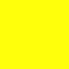

# Colores Hexadecimales

| | |
|:-------------:|:-------------:|
|  `#FF3333` |  `#CC0000` |
|  `#000000 ` |  `#FFFFFF ` |
|  `#bbbbbb ` |  `#b0b0b0 ` |
|  `#696969 ` |  `#424242 ` |
|  `#FFF212 ` |  `#C1B800 ` |
|  `#006600 ` |  `#33cc33 ` |
|  `#FE2E2E ` |  `#0000FF ` |
|  `#FF8000 ` |  `#FFFF00 ` |
|  `#FA9A9A ` |  `#F7D358 ` |
|  `#82FA58 ` |  `#F4FA58 ` |
|  `#98A4AE 7543 ` |  `#B7C9D3 5445 ` |
|  `#084B8A ` |  `#00BFFF ` |
